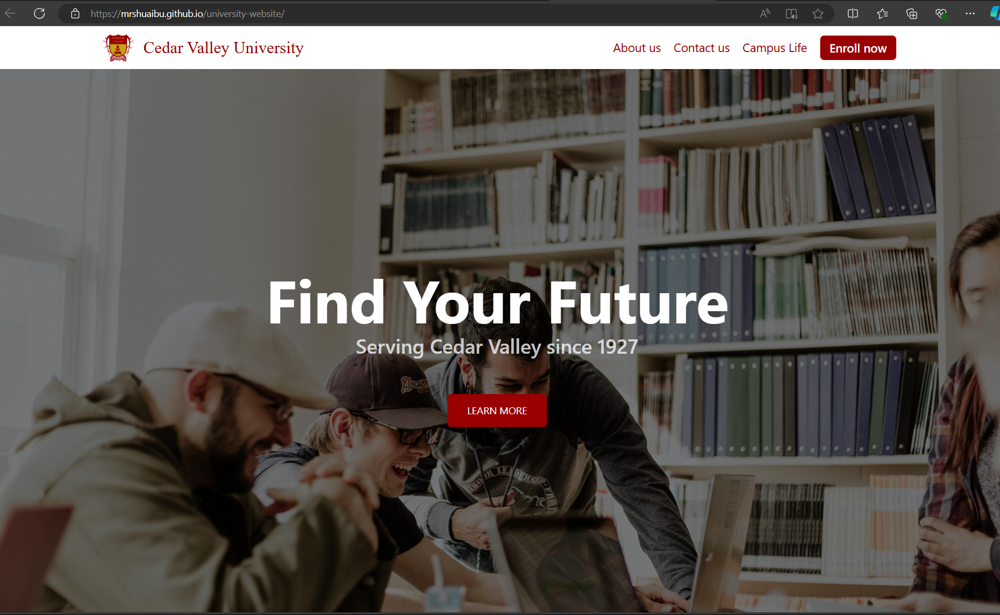
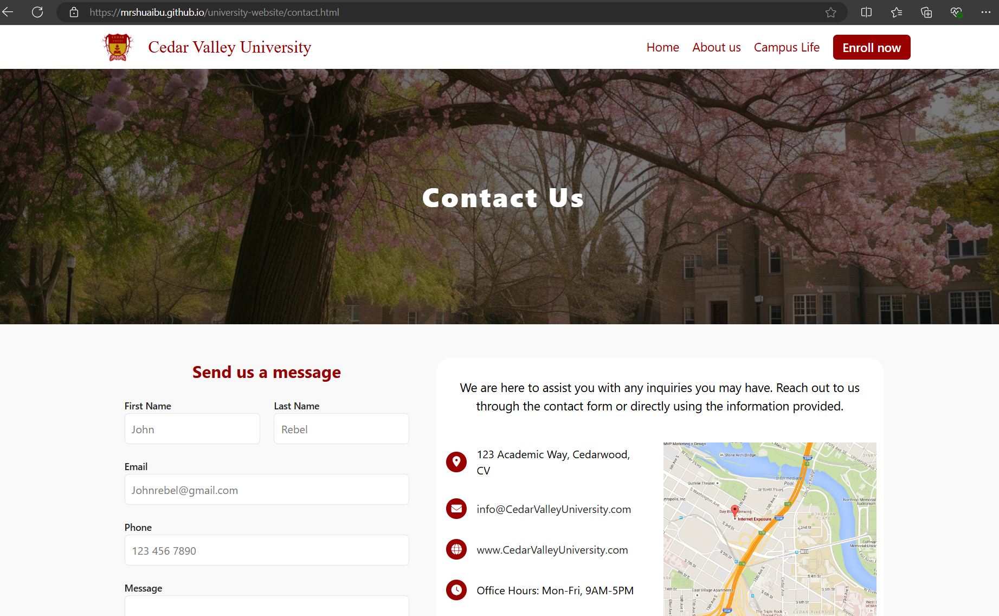

# Cedar Valley University

A responsive website for Cedar Valley University, designed to provide students, 
alumni, and visitors with easy access to university information, programs, and 
resources.

## Project Features

- Responsive design for optimal viewing on any device.
- Sections for undergraduate, graduate, and professional certificate programs.
- Recent news section with updates and events.
- User-friendly navigation with a clean layout.
- Integrated social media links.

## Screenshots

*This is the landing page of the website.*

*This is the about us page.*

*This is the contact us page.*

## Team members

- [Oluwajuwon Michael Shuaibu](https://github.com/mrshuaibu) (Me)
- [Myles Reid](https://github.com/myles-reid)
- [David Sommerville](https://github.com/davidsommerville)
- [Samuel Reutcky](https://github.com/SamuelReutcky)

## Technologies Used

